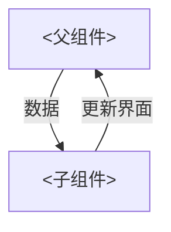

# React 学习

## 特性

* 单向数据流
* 数据驱动免除了 操作`dom`树，`React `负责操控
* 组件化，多处复用

## JSX简介

### JSX属性

JSX元素也可以像HTML元素一样拥有属性,一个JSX属性使用类似HTMl语法编写,一个名称后面跟着一个等于号,接着是一个值,这个值应该用一对引号将其包裹,像这样:

``` rea
my-attribute-name = "my-attribute-value"
```

下面是一些带属性的JSX元素

```react
<a href='http://www.example.com'>Welcome to the Web</a>;

const title = <h1 id='title'>Introduction to React.js: Part I</h1>; 
```

一个单独的JSX元素可以像HTML一样有很多元素

```react
const panda = 
```

JSX外部元素有个规则:一个JSX表达式只能有一个最外层元素.

以下代码可以解析:

``` js
const paragraphs = (
  <div id="i-am-the-outermost-element">
    <p>I am a paragraph.</p>
    <p>I, too, am a paragraph.</p>
  </div>
);
```

但是这个代码就无法解析了

``` js
const paragraphs = (
  <p>I am a paragraph.</p> 
  <p>I, too, am a paragraph.</p>
);
```

所以JSX表达式最外层最好用`<div></div>` 标签包裹

## 元素渲染

`ReactDOM`是一个`JavaScript` 库的名字,这个库中包含了几个`React`特有的方法,这些方法大部分都是用来处理`DOM`元素的.

`ReactDOM.render()` 是渲染JSX 最常用的方法,它接受一个JSX表达式,创建一个对应的DOM节点树,并且将该树添加到DOM中.

参数一: JSX表达式,它将被渲染到屏幕上

```js
ReactDOM.render(<h1>Hello world</h1>, document.getElementById('app')),
```

### 列表渲染

使用原生的 `map` 来进行,重复渲染的是哪一个模板就 `return ` 谁

**注**： 遍历列表的时候同样需要一个类型为 `number/string` 的不可重复的 `key` 来提高 `diff` 性能

`key` 不会被渲染到真实 `dom` 中，仅仅存在于 `React` 中

``` jsx
const names = ["赵", "钱", "孙", "李", "周", "吴", "郑", "王"];

export default function testDemo() {
  return (
    <div>
      <p>列表渲染</p>
      <ul>
        {names.map((i) => (
          <li key={i}>老{i}头</li>
        ))}
      </ul>
    </div>
  );
}
```

#### 条件渲染

* 使用三元运算符
* 使用逻辑与运算符

``` jsx
export default function CanSmoke(props) {
  const age = props.age;
  return (
    <div>
      <h1>Hello!</h1>
      {age > 18 && <h3>you can somoke!</h3>} // 与运算符,年龄大于18岁可以抽烟
    </div>
  );
}

// main.jsx
<Condition age={28} />
```


### props和state

`props` 是组件对外的接口，`state` 是组件对内的接口。

**props**

* `props` 也叫做属性
* 属性一定是从上层元素自上而下的传递下来
* 属性是只读的，不能组件内部修改 `props` 只能在该组件的上层组件中修改 

**state**

* `state` 也叫做状态
* 可以理解为组件自身存储的私有变量

**单向数据流**

> 避免了数据在组件中来回传递




 

 

 
